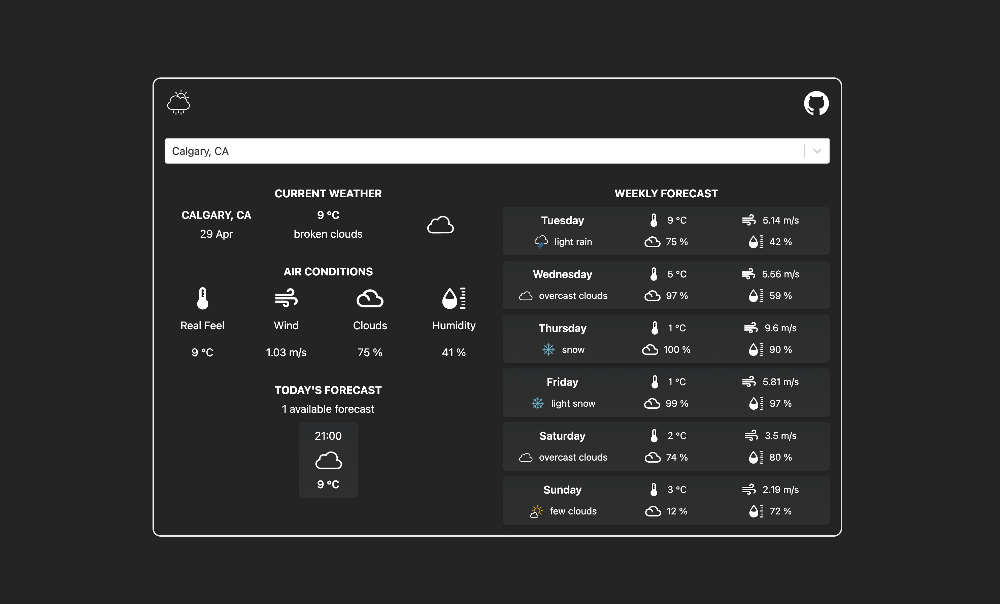

# The Weather App (React + TypeScript + Vite)


<br/>

The Weather App provides the ability to search locations by city name and find the weather for the next 5-6 days.
The app is developed using React.js (TypeScript) and Tailwind.css.

## Live Demo

https://vitalii-plechak-the-weather-app.netlify.app/

## Getting Started
1. You need an API key from [OpenWeatherMap](https://openweathermap.org/)
2. Under `src/conf` replace the `WEATHER_API_KEY` with your OpenWeatherMap API Key

## Installation
1. Make sure you have Node and npm installed
2. Clone the repository
```bash
  git clone https://github.com/Vitalii-Plechak/Weather-App.git
```
3. Run `npm install`